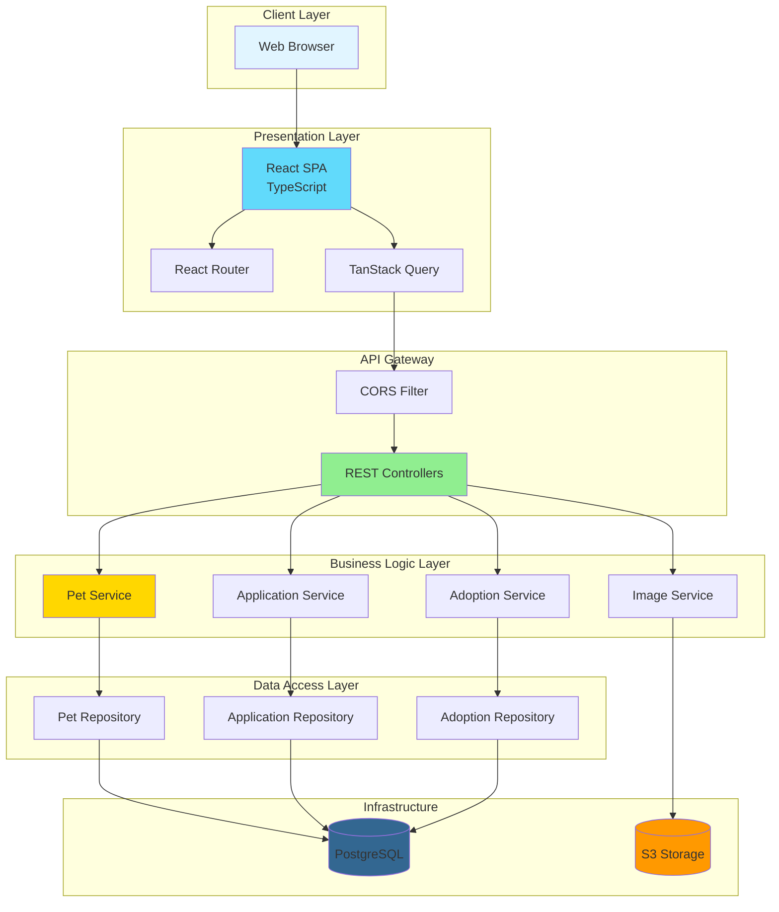
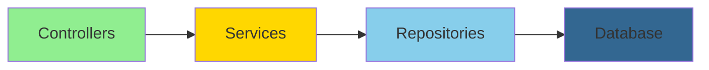
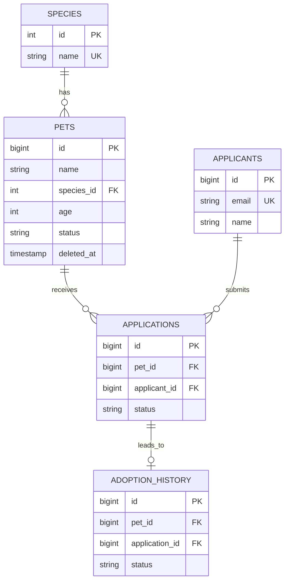
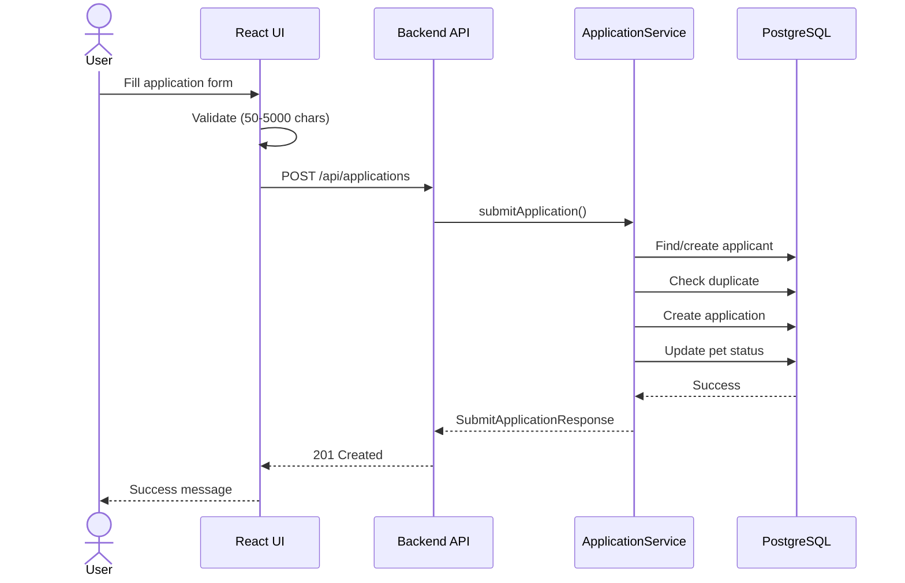
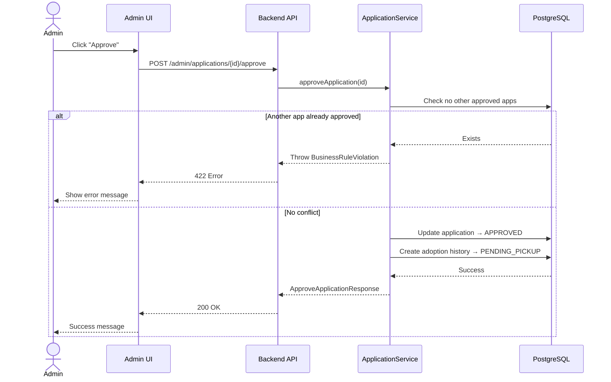
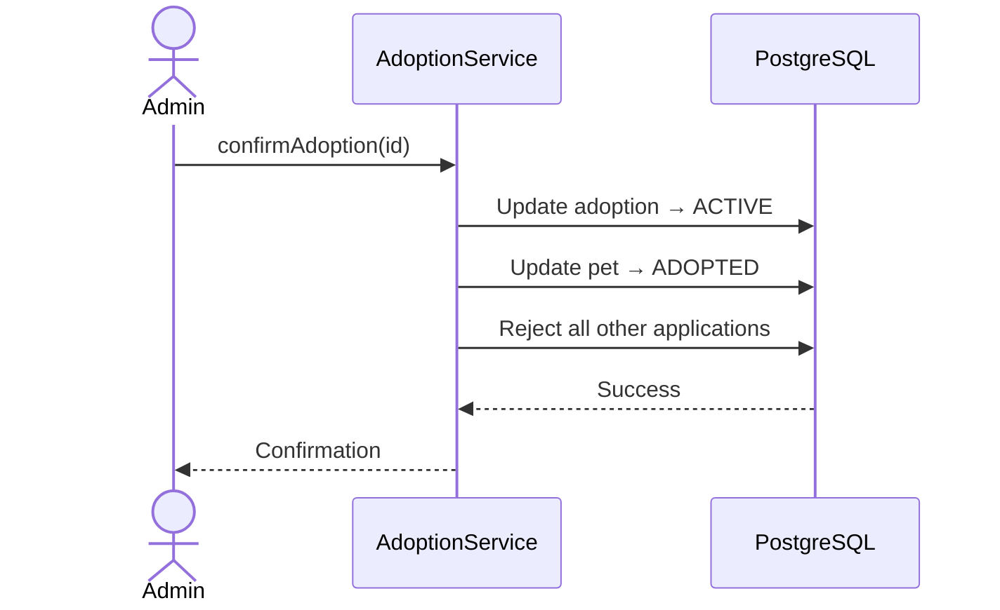

# System Architecture

## Overview

The Animal Shelter Adoption Portal follows a **layered architecture** pattern with clear separation of concerns between
presentation, business logic, and data access layers.

## High-Level Architecture Diagram



## Component Details

### Frontend (React SPA)

**Responsibility:** User interface and client-side state management

**Architecture:**

```
src/
├── components/
│   ├── common/        # Reusable UI (Button, Modal, Input)
│   ├── layout/        # Header, Footer, Container
│   └── pets/          # Pet-specific (PetCard, ApplicationForm)
├── pages/
│   ├── public/        # HomePage, PetListPage, PetDetailsPage
│   └── admin/         # AdminDashboard, ApplicationsPage, etc.
├── hooks/             # Custom React hooks (usePets, useAdmin)
├── api/               # API client functions
├── types/             # TypeScript definitions
└── utils/             # Helper functions
```

**Key Technologies:**

- **React Router:** Client-side routing
- **TanStack Query:** Server state caching and synchronization
- **Tailwind CSS:** Utility-first styling
- **Axios:** HTTP client with interceptors

**State Management Strategy:**

- **Server State:** TanStack Query (pets, applications, adoptions)
- **UI State:** React useState/useReducer (modals, forms)
- **No Redux:** Not needed for this scope

---

### Backend (Spring Boot)

**Responsibility:** Business logic, data persistence, API endpoints

**Layered Architecture:**



#### **1. Controller Layer**

**Responsibility:** HTTP request/response handling

**Files:**

- `PublicController` - Public endpoints (/api/pets, /api/applications)
- `AdminApplicationController` - Admin application management
- `PetManagementController` - Pet CRUD + image upload

**Responsibilities:**

- Input validation (`@Valid`)
- DTO mapping
- HTTP status codes
- Exception handling (via `GlobalExceptionHandler`)

**Example:**

```kotlin
@RestController
@RequestMapping("/api")
class PublicController(private val petService: PetService) {

    @GetMapping("/pets")
    fun getPets(
        @RequestParam status: PetStatus?,
        @RequestParam speciesId: Int?
    ): List<PetDto> = petService.findAll(status, speciesId)
}
```

#### **2. Service Layer**

**Responsibility:** Business logic and transaction management

**Files:**

- `PetService` - Pet management logic
- `ApplicationService` - Application workflow
- `AdoptionService` - Adoption lifecycle
- `ApplicantService` - Applicant management
- `ImageService` - S3 operations

**Responsibilities:**

- Business rule enforcement
- Transaction boundaries (`@Transactional`)
- Complex workflows
- Cross-entity operations

**Example:**

```kotlin
@Service
class ApplicationService {

    @Transactional
    fun approveApplication(id: Long): Response {
        // 1. Validate business rules
        // 2. Check no other approved apps
        // 3. Update application status
        // 4. Create adoption history
        // 5. Return response
    }
}
```

#### **3. Repository Layer**

**Responsibility:** Data access abstraction

**Files:**

- `PetRepository`
- `ApplicationRepository`
- `AdoptionHistoryRepository`
- `ApplicantRepository`
- `SpeciesRepository`

**Responsibilities:**

- CRUD operations
- Custom queries (Spring Data JPA)
- Query methods

**Example:**

```kotlin
interface ApplicationRepository : JpaRepository<Application, Long> {
    fun findByPetIdAndStatusIn(
        petId: Long,
        statuses: List<ApplicationStatus>
    ): List<Application>

    fun existsByPetIdAndApplicantId(
        petId: Long,
        applicantId: Long
    ): Boolean
}
```

#### **4. Domain Model**

**Entities:**

- `Pet` - Pet with status lifecycle
- `Application` - Adoption application
- `AdoptionHistory` - Adoption tracking
- `Applicant` - Person applying
- `Species` - Reference data

**Enums:**

- `PetStatus` - AVAILABLE, PENDING, ADOPTED
- `ApplicationStatus` - PENDING, APPROVED, REJECTED, ADOPTION_CANCELLED
- `AdoptionStatus` - PENDING_PICKUP, ACTIVE, RETURNED, CANCELLED

---

### Database (PostgreSQL)

**Responsibility:** Data persistence and integrity



**Features:**

- Foreign key constraints (referential integrity)
- Check constraints (enum validation)
- Unique constraints (prevent duplicates)
- Triggers (auto-update timestamps)
- Indexes (query optimization)
- Soft deletes (audit trail)

---

## Data Flow Examples

### Application Submission Flow



### Application Approval Flow



### Adoption Confirmation Flow



---

## Design Patterns Used

### 1. Repository Pattern

**Purpose:** Abstract data access logic

**Benefits:**

- Testable (mock repositories)
- Database-agnostic
- Single source of truth for queries

### 2. Service Layer Pattern

**Purpose:** Encapsulate business logic

**Benefits:**

- Transaction boundaries
- Reusable across controllers
- Centralized business rules

### 3. DTO Pattern

**Purpose:** Decouple API from domain model

**Benefits:**

- API versioning flexibility
- Hide sensitive fields
- Validation separation

### 4. Builder Pattern

**Purpose:** Construct complex objects

**Implementation:** Kotlin data classes with default values

```kotlin
data class Pet(
    val name: String,
    val age: Int,
    val species: Species,
    val status: PetStatus = PetStatus.AVAILABLE
)
```

---

## Security Considerations (Future)

**Current:** None (demo project)

**Production Would Include:**

- JWT authentication
- Role-based access control (Public vs Admin)
- Input sanitization
- SQL injection prevention (JPA handles this)
- CORS whitelist (not wildcard)
- HTTPS only

---

## Scalability Considerations (Future)

**Current:** Single instance

**Production Would Include:**

- Database connection pooling (HikariCP - already configured)
- Redis caching layer
- Read replicas for analytics
- CDN for static assets
- Horizontal scaling with load balancer
- Asynchronous processing (email notifications)

---

## Performance Optimizations

**Implemented:**

- Database indexes on foreign keys
- TanStack Query caching (frontend)
- Lazy loading for images
- Pagination ready (not implemented yet)

**Future:**

- Redis caching
- Database query optimization
- Image CDN
- Connection pooling tuning

---

## Error Handling Strategy

**Frontend:**

```typescript
// Global error handler in API client
apiClient.interceptors.response.use(
  response => response,
  error => {
    const errorData = error.response?.data
    error.message = errorData.message
    return Promise.reject(error)
  }
)
```

**Backend:**

```kotlin
@RestControllerAdvice
class GlobalExceptionHandler {

    @ExceptionHandler(BusinessRuleViolationException::class)
    fun handleBusinessRule(ex: Exception): ResponseEntity<ErrorResponse> {
        return ResponseEntity
            .status(422)
            .body(ErrorResponse(...))
    }
}
```

---

## Technology Integration Points

### Frontend ↔ Backend

- **Protocol:** HTTP/HTTPS
- **Format:** JSON
- **Authentication:** None (future: JWT)
- **CORS:** Configured for localhost:5173

### Backend ↔ Database

- **Protocol:** JDBC
- **ORM:** Hibernate/JPA
- **Connection Pool:** HikariCP
- **Migrations:** Flyway

### Backend ↔ S3

- **SDK:** AWS SDK for Java
- **Protocol:** HTTPS
- **Dev:** LocalStack
- **Prod:** AWS S3

---

## Deployment Architecture (Future)

```
[User] → [CloudFront CDN] → [S3 (React Build)]
         [Route 53]       → [ALB] → [ECS/Fargate]
                                      ↓
                                   [RDS PostgreSQL]
                                   [S3 (Images)]
```

---

## Monitoring Strategy (Future)

**Logging:**

- Structured JSON logs
- Correlation IDs
- ELK stack (Elasticsearch, Logstash, Kibana)

**Metrics:**

- Spring Boot Actuator
- Prometheus
- Grafana dashboards

**Tracing:**

- Jaeger or Zipkin
- Distributed request tracing

---

## Testing Strategy (Future)

**Backend:**

- Unit tests (JUnit 5 + MockK)
- Integration tests (TestContainers)
- API tests (RestAssured)

**Frontend:**

- Component tests (React Testing Library)
- Hook tests
- E2E tests (Playwright)

**Target Coverage:** 80%

---

## Development Workflow

```
Feature Branch → Pull Request → Code Review → CI/CD → Deploy

CI Checks:
- Build (Gradle + npm)
- Tests
- Linting
- Security scan
```

---

## Documentation Standards

All code follows:

- KDoc for Kotlin (similar to JavaDoc)
- TSDoc for TypeScript
- README per module
- API documentation (this file)
- Architecture diagrams (Mermaid)