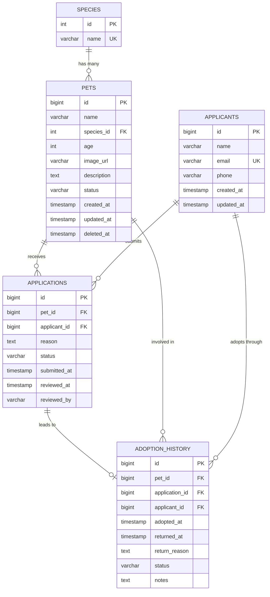

# Database Design

## Entity Relationship Diagram



## Tables

### species

**Purpose:** Reference table for pet types

| Column | Type        | Constraints                 | Description                   |
|--------|-------------|-----------------------------|-------------------------------|
| id     | INT         | PRIMARY KEY, AUTO_INCREMENT | Unique identifier             |
| name   | VARCHAR(50) | NOT NULL, UNIQUE            | Species name (Dog, Cat, etc.) |

**Sample Data:**

```sql
INSERT INTO species (name)
VALUES ('Dog'),
       ('Cat'),
       ('Rabbit'),
       ('Bird'),
       ('Guinea Pig');
```

---

### pets

**Purpose:** Pet inventory with status tracking

| Column      | Type         | Constraints                   | Description                     |
|-------------|--------------|-------------------------------|---------------------------------|
| id          | BIGINT       | PRIMARY KEY, AUTO_INCREMENT   | Unique identifier               |
| name        | VARCHAR(100) | NOT NULL                      | Pet's name                      |
| species_id  | INT          | FK → species.id, NOT NULL     | Species reference               |
| age         | INT          | NOT NULL                      | Age in years                    |
| image_url   | VARCHAR(500) | NULLABLE                      | S3 image URL                    |
| description | TEXT         | NULLABLE                      | Pet description                 |
| status      | VARCHAR(20)  | NOT NULL, DEFAULT 'AVAILABLE' | AVAILABLE \| PENDING \| ADOPTED |
| created_at  | TIMESTAMP    | NOT NULL, DEFAULT NOW()       | Record creation time            |
| updated_at  | TIMESTAMP    | NOT NULL, DEFAULT NOW()       | Last update time                |
| deleted_at  | TIMESTAMP    | NULLABLE                      | Soft delete timestamp           |

**Constraints:**

```sql
CHECK
    (status IN ('AVAILABLE', 'PENDING', 'ADOPTED'))
    CHECK
    (age >= 0 AND age <= 50)
```

**Indexes:**

```sql
CREATE INDEX idx_pets_species_id ON pets (species_id);
CREATE INDEX idx_pets_status ON pets (status);
CREATE INDEX idx_pets_deleted_at ON pets (deleted_at);
```

---

### applicants

**Purpose:** People who apply to adopt pets

| Column     | Type         | Constraints                 | Description           |
|------------|--------------|-----------------------------|-----------------------|
| id         | BIGINT       | PRIMARY KEY, AUTO_INCREMENT | Unique identifier     |
| name       | VARCHAR(200) | NOT NULL                    | Applicant's full name |
| email      | VARCHAR(255) | NOT NULL, UNIQUE            | Email address         |
| phone      | VARCHAR(20)  | NULLABLE                    | Phone number          |
| created_at | TIMESTAMP    | NOT NULL, DEFAULT NOW()     | Record creation time  |
| updated_at | TIMESTAMP    | NOT NULL, DEFAULT NOW()     | Last update time      |

**Indexes:**

```sql
CREATE UNIQUE INDEX idx_applicants_email ON applicants (email);
```

---

### applications

**Purpose:** Adoption applications with review status

| Column       | Type         | Constraints                  | Description            |
|--------------|--------------|------------------------------|------------------------|
| id           | BIGINT       | PRIMARY KEY, AUTO_INCREMENT  | Unique identifier      |
| pet_id       | BIGINT       | FK → pets.id, NOT NULL       | Pet being applied for  |
| applicant_id | BIGINT       | FK → applicants.id, NOT NULL | Applicant              |
| reason       | TEXT         | NOT NULL                     | Why they want to adopt |
| status       | VARCHAR(30)  | NOT NULL, DEFAULT 'PENDING'  | Application status     |
| submitted_at | TIMESTAMP    | NOT NULL, DEFAULT NOW()      | Submission time        |
| reviewed_at  | TIMESTAMP    | NULLABLE                     | Review timestamp       |
| reviewed_by  | VARCHAR(100) | NULLABLE                     | Admin who reviewed     |

**Constraints:**

```sql
CHECK
    (status IN ('PENDING', 'APPROVED', 'REJECTED', 'ADOPTION_CANCELLED'))
    UNIQUE
    (pet_id, applicant_id) -- One application per pet per person
```

**Indexes:**

```sql
CREATE INDEX idx_applications_pet_id ON applications (pet_id);
CREATE INDEX idx_applications_applicant_id ON applications (applicant_id);
CREATE INDEX idx_applications_status ON applications (status);
```

---

### adoption_history

**Purpose:** Track adoption lifecycle from approval to completion/return

| Column         | Type        | Constraints                        | Description          |
|----------------|-------------|------------------------------------|----------------------|
| id             | BIGINT      | PRIMARY KEY, AUTO_INCREMENT        | Unique identifier    |
| pet_id         | BIGINT      | FK → pets.id, NOT NULL             | Adopted pet          |
| application_id | BIGINT      | FK → applications.id, NOT NULL     | Approved application |
| applicant_id   | BIGINT      | FK → applicants.id, NOT NULL       | Adopter              |
| adopted_at     | TIMESTAMP   | NOT NULL, DEFAULT NOW()            | Approval timestamp   |
| returned_at    | TIMESTAMP   | NULLABLE                           | Return timestamp     |
| return_reason  | TEXT        | NULLABLE                           | Why pet was returned |
| status         | VARCHAR(20) | NOT NULL, DEFAULT 'PENDING_PICKUP' | Adoption status      |
| notes          | TEXT        | NULLABLE                           | Admin notes          |

**Constraints:**

```sql
CHECK
    (status IN ('PENDING_PICKUP', 'ACTIVE', 'RETURNED', 'CANCELLED'))
```

**Indexes:**

```sql
CREATE INDEX idx_adoption_pet_id ON adoption_history (pet_id);
CREATE INDEX idx_adoption_application_id ON adoption_history (application_id);
CREATE INDEX idx_adoption_applicant_id ON adoption_history (applicant_id);
CREATE INDEX idx_adoption_status ON adoption_history (status);
```

---

## Database Triggers

### Auto-update `updated_at` timestamps

```sql
CREATE OR REPLACE FUNCTION update_updated_at_column()
    RETURNS TRIGGER AS
$$
BEGIN
    NEW.updated_at = NOW();
    RETURN NEW;
END;
$$ LANGUAGE plpgsql;

CREATE TRIGGER update_pets_updated_at
    BEFORE UPDATE
    ON pets
    FOR EACH ROW
EXECUTE FUNCTION update_updated_at_column();

CREATE TRIGGER update_applicants_updated_at
    BEFORE UPDATE
    ON applicants
    FOR EACH ROW
EXECUTE FUNCTION update_updated_at_column();
```

---

## Referential Integrity

All foreign keys use `ON DELETE RESTRICT` to prevent data loss:

```sql
-- Example from applications table
CONSTRAINT fk_application_pet 
    FOREIGN KEY (pet_id) REFERENCES pets(id) ON
DELETE RESTRICT
    CONSTRAINT fk_application_applicant
    FOREIGN KEY (applicant_id) REFERENCES applicants(id)
ON
DELETE RESTRICT
```

**Rationale:**

- Historical data must be preserved
- Soft delete for pets (deleted_at) instead of hard delete
- Cannot delete pets/applicants with active applications

---

## Data Flow Examples

### Application Submission Flow

```
1. User submits application
   → Check: applicants table for existing email
   → Insert/Update: applicant record
   → Insert: application record (status=PENDING)
   → Update: pets.status to PENDING (if was AVAILABLE)
```

### Application Approval Flow

```
1. Admin approves application
   → Validate: No other APPROVED applications for this pet
   → Update: applications.status to APPROVED
   → Insert: adoption_history (status=PENDING_PICKUP)
```

### Adoption Confirmation Flow

```
1. Admin confirms pet pickup
   → Update: adoption_history.status to ACTIVE
   → Update: pets.status to ADOPTED
   → Update: All other applications for this pet to REJECTED
```

### Pet Return Flow

```
1. Admin marks pet as returned
   → Update: adoption_history.status to RETURNED
   → Update: adoption_history.returned_at
   → Update: pets.status to AVAILABLE
```

---

## Migration Strategy

Using Flyway for version-controlled migrations:

```
src/main/resources/db/migration/
├── V1__create_species_table.sql
├── V2__create_pets_table.sql
├── V3__create_applicants_table.sql
├── V4__create_applications_table.sql
├── V5__create_adoption_history_table.sql
├── V6__create_triggers.sql
└── V7__seed_initial_species.sql
```

**Naming Convention:** `V{version}__{description}.sql`

**Execution:** Automatic on application startup (Spring Boot + Flyway)

---

## Database Configuration

### Development

```yaml
spring:
  datasource:
    url: jdbc:postgresql://localhost:5432/animal_shelter
    username: shelter_user
    password: shelter_pass
  jpa:
    hibernate:
      ddl-auto: validate  # Never auto-create, use Flyway
    show-sql: true
```

### Production

```yaml
spring:
  datasource:
    url: ${DATABASE_URL}  # From environment
    hikari:
      maximum-pool-size: 10
      minimum-idle: 5
  jpa:
    show-sql: false
    properties:
      hibernate:
        format_sql: false
```

---

## Query Optimization

### Common Queries

**Get available pets with application count:**

```sql
SELECT p.*, COUNT(a.id) as pending_applications
FROM pets p
         LEFT JOIN applications a ON p.id = a.pet_id AND a.status = 'PENDING'
WHERE p.deleted_at IS NULL
  AND p.status IN ('AVAILABLE', 'PENDING')
GROUP BY p.id;
```

**Get applications for admin review:**

```sql
SELECT a.*, p.name as pet_name, ap.name as applicant_name
FROM applications a
         JOIN pets p ON a.pet_id = p.id
         JOIN applicants ap ON a.applicant_id = ap.id
WHERE a.status = 'PENDING'
ORDER BY a.submitted_at ASC;
```

### Index Usage

All foreign keys are indexed automatically. Additional indexes:

- `pets.status` - Frequent filtering
- `applications.status` - Admin dashboard queries
- `applicants.email` - Lookup for duplicate detection

---

## Backup Strategy (Production)

**Recommended:**

- Automated daily backups (AWS RDS automated backups)
- Point-in-time recovery enabled
- 7-day retention for development
- 30-day retention for production
- Weekly backups exported to S3 for long-term archival

**Restoration Process:**

```sql
-- Restore from RDS snapshot
aws rds restore-db-instance-from-db-snapshot
\
--db-instance-identifier animal-shelter-restored \
--db-snapshot-identifier snapshot-2024-01-01
```